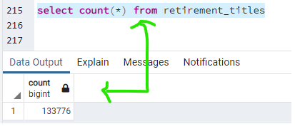

# Pewlett_Hackard_Analysis

The purpose of the new analysis is well defined. (3 pt)
Results:

There is a bulleted list with four major points from the two analysis deliverables. (6 pt)
Summary:

The summary addresses the two questions and contains two additional queries or tables that may provide more insight. (5 pt)

Now that Bobby has proven his SQL chops, his manager has given both of you two more assignments: determine the number of retiring employees per title, and identify employees who are eligible to participate in a mentorship program. Then, you’ll write a report that summarizes your 
analysis and helps prepare Bobby’s manager for the “silver tsunami” as many current employees reach retirement age.

## Pewlett Hackard Analysis Overview
PewLett Hackard has been woring with Bobby in conducting an over-view of their retiring employees or to be more exact, those who are eligible for retirment. To that end, 3 csv files were created that showed from some originally provided data of ALL employees and the following tables were created for the first part of the analysis:

- current_emp.csv which showed ALL current employees elibible for retirement
- emp_info.csv which included information about those employees salaries
- manager_inf which identified which managers are due for retirement

Because Bobby impressed the PH senior management with the 3 original output files, they wanted him to do 2 additional analysis:
1) 3 queries were requested on some more of the general information about ALL the employees who are retiring: 
- A query was written for employees who are born between January 1, 1952 and December 31, 1955: retirement_titles.csv
- A query was written that contains the employee number, first and last name, and most recent title: unique_titles.csv.
- A query was written to create a table with the number of titles filled by employees who are retiring: retiring_titles.csv. 

2) The second request was for a more targeted program: determine the number of retiring employees per title, and identify employees who are eligible to participate in a mentorship program. For this, the data was more targeted; those employees who were born in 1965, a few years away from the eligibility age. PH would like to capitalize on this group's knowledge base and use it to crate a training or mentorship program. This will also help PH keep a closer eye on those employees whose retirement is approaching.  Bobby created one output file for this second piece:

- mentorship_eligibilty.csv

## PH Analysis Results:
Here are some interestng information that may need some further analysis to fully understand:
1) When you look at the retirement_titles.csv count vs the over-all employees.csv count, it shows an alarming number of employees are eligible to leave the company.  While there are some differences on the data-points of these two tables, a closer look needs to be taken to fully understand the situation.

## PyBer Analysis Results:
There were 5 key metrics being calculated in doing the PyBer ridershare analysis.  Below are the details uncovered for each metric as shown in attached shot of the dataframe created with reesult of analysis:

### Total Rides by City Type - This metric, shows that as you go from Urban to Suburban to Rural, the number of rides decreases.  This would be expected, partly due to the population of those areas; Less people = less required rides.
### Total Drivers by City Type  - Similar to rides per city type, this metric as you go from Urban to Suburban to Rural, the number of drivers decreases.  This would be expected, again partly due to the population of those areas.
### Total Fares by City Type  - Total fares would be impacted by the above two factors, Total Rides per City Type and Total Drivers.
### Average Fare per Ride by City Type - this metric indicates that as the area of driving increases, so does the fare.  Therefore, you would expect the average fare to be higher as the distances of the rides becomes further.
### Average Fare per Driver by City Type - same as above metric, Average Fare per Ride, this metric would increase as the distances increase as you go from Urban all the way to Rural.

## PyBer Analysis Summary
If we look at the metrics in the above output and the below data graph

 
Leave a comment
No file chosen
Attach files by dragging & dropping, selecting or pasting them.

- As expected, and noted above, as we go from a very populate urban area in a smaller space compared to a less populated suburban area, again compared to the area of land, and then finally to the rural area, which would have the greatest amount of land expanse to traverse as a driver to get from point A to point B, the fare per ride and driver would increase.
- While it may look unevenly 
- The above is somewhat to be expected, once you see the graph and ouput. But to really get to the bottom of the data, there are a few more data ponts that would need to be investigated:
1) There needs to be a closer look at the ratio of drivers to type of city and daily total fares per driver per city type.  
2) There must be drivers who traverse one or two or even all of the types: rural, suburban and urban.  Which group did those folks put themselves in and how much of am impact does it have on there rates?
3) Length of time per ride; We should take a look at the length of time per ride and the impact on the overall data, especially the Avererage Fare per Ride and Driver.  There may not be enough time for those drivers to have more rides.
4) Once a closer look at these additional metrics have been completed it can be determined if we need more or less drivers in each city type and perhaps other additonal metrics will be revieled. 
## Resources
- Data Source: city_data.csv 
	       ride_data.csv
- Software: Matplotlib, Scipy, Pandas and Nympy.
# Challenge Overview
There were definitely parts of the challenge that were not clear which resulted in me wasting time on irrelevent points. Otherwise, it was a fun challenge - like a puzzle you are both creating and solving at the same time.
